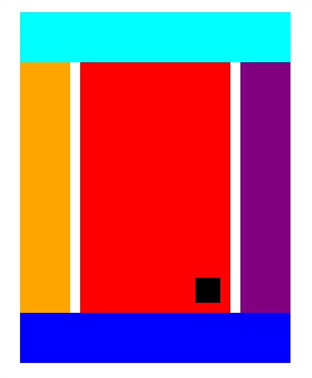

# All together

## Help

- [Questions to this exercise](http://askbot.greenfox.academy/questions/tags:all-together/)

## The Overview

- Create a new pen on Codepen to work with
- You'll create this:
  - The whole layout should be centered on the page.
  - The whole layout should have fixed width.
  - When picking the semantically correct element, consider the roles of the boxes:
    - `aqua` (light blue): Header
    - `orange`: Left sidebar (not main content)
    - `red`: Main Content
    - `black`: Fixed content on the bottom right of the Main - content
    - `purple`: Right sidebar (not main content)
    - `blue`: Footer

### [Solution pen](https://codepen.io/adamgyulavari/pen/mdeOZzG?editors=1100)
