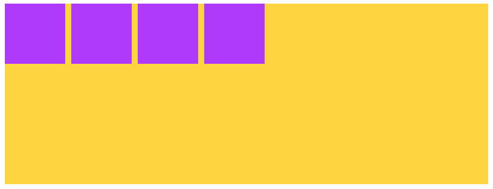
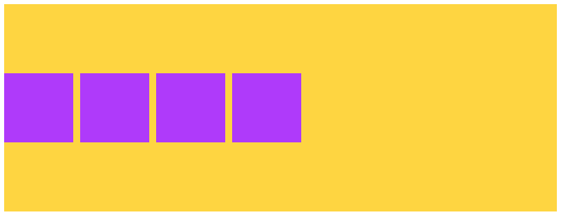
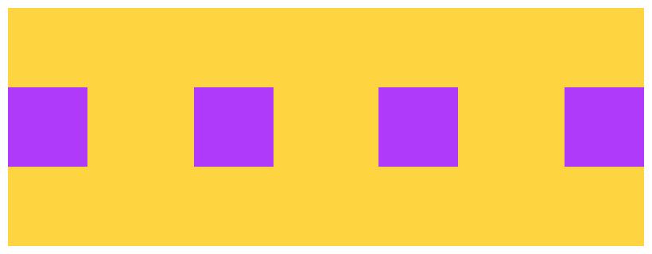

# Arranging 4 boxes

## Help

- [Questions to this exercise](http://askbot.greenfox.academy/questions/tags:arranging-boxes/)

## The Overview

- Create a new pen on Codepen to work with
- This exercise is for trying out different arrangements in flexbox
- Go through each step, but you can skip the descriptive parts and just reproduce the images

## Step by Step

Use this HTML structure for the exercise:

```html
<ul class="container">
  <li class="item"></li>
  <li class="item"></li>
  <li class="item"></li>
  <li class="item"></li>
</ul>
```

Remember that some elements have default styling. For example the `ul` element has `padding` and a `list-style-type` by default.

### Style the elements like this using flexbox on the container

- The yellow box is `#ffd62a` colored `400px` wide and `150px` tall
- The purple boxes are `#b02afe` colored `50px` wide and `50px` tall
- There's `5px` space between them



Now the direction is `row` so the main axis is horizontal line. You already know how to align the elements on the main axis with `justify-content`. It's time to align them on the cross axis. Now it is a vertical line, so using the `align-items` property you can vertically align the items to the `flex-start`, `flex-end` or `center`.

```css
.container {
  align-items: flex-end;
}
```

### Align the items to the center vertically



### Split the space between them evenly

- You'll need to remove the margin from the purple boxes if you have any



### Arrange the purple boxes to the bottom right corner


## [Solution Pen](https://codepen.io/adamgyulavari/pen/RwPOrYx)
