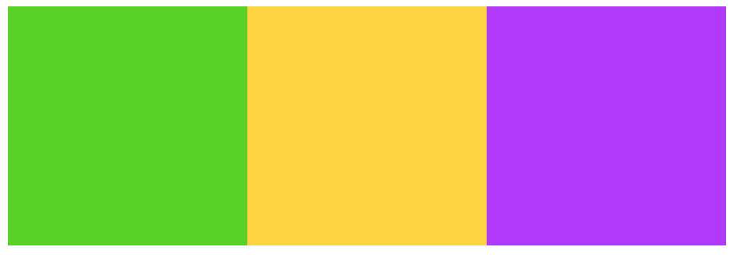
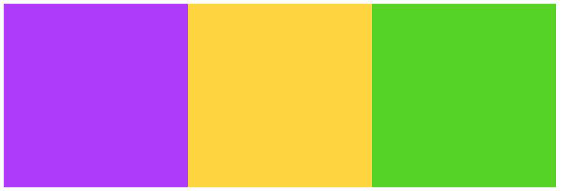
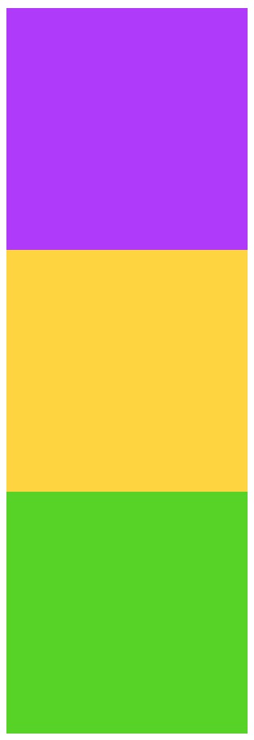
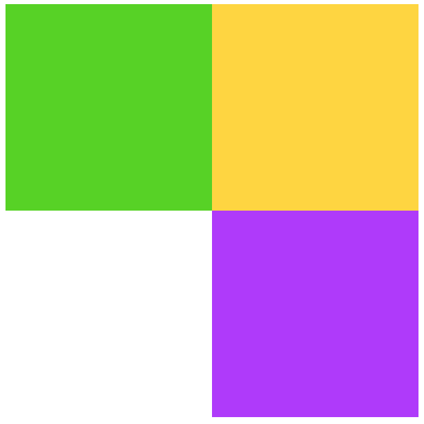

# Basic Flex properties

## Help

- [Questions to this exercise](http://askbot.greenfox.academy/questions/tags:basic-flex/)

## The Overview

- Create a new pen on Codepen to work with
- This exercise is for trying out different arrangements in flexbox
- Go through each step, but you can skip the descriptive parts and just reproduce the images

## Step by Step

Using the following HTML structure:

```html
<div class="container">
  <div class="item green"></div>
  <div class="item yellow"></div>
  <div class="item purple"></div>
</div>
```

You can copy this into your Codepen.

This exercise is about trying out flexbox properties in CSS. Using flexbox you can create interesting layouts that can adapt to the screen size if used correctly. When using flexbox you need a container and elements inside of it. In the previous exercise you already used this to put elements next to each other. The flexbox will put the items in the container at the specified `flex-direction`. The default is `row`, so the items will be placed in a row if there's nothing specified. But you can set the direction to `column`, `row-reverse` and `column-reverse` too. Setting the direction is setting the **main axis** of the flexbox container.

```css
.container {
  display: flex;
  flex-direction: row-reverse;
}
```

### Style them with a color and a fixed width and height next to each other

- The `width` and `height` can be `150px`
- The colors: `#51d400`, `#ffd62a`, `#b02afe`



### Make the order of the boxes reversed



### Make them appear in a `column` but in reversed order



Sometimes the content can't fit into one line because there's not enough space. The viewer's window or the screen is too small. In this case you can either shrink these boxes, but you can also put them into new lines. By default flexbox will shrink the items. Try to add a fixed `width` to the container that is smaller than `450px`. But you can change that to break the not fitting items into a new line by using the `flex-wrap` property with a `wrap` value:

```css
.container {
  flex-wrap: wrap;
}
```

### Change the direction back to row then set the `width` of the container to `300px` and the `flex-wrap` property to `wrap`


By default the items will be put the start of the flexbox. If the direction is `row` the start is the left side, if the direction is `column` the start is the top. The end is the right and the bottom in these cases. If you want to put the items on the main axis somehow differently you can use the `justify-content` property. If there's leftover space you can split the elements evenly with `space-between` or `space-around`. But you can also put them in the `center` or to the `flex-end`.

```css
.container {
  justify-content: space-around;
}
```

### Move the purple box to the right side



## [Solution Pen](https://codepen.io/adamgyulavari/pen/KKpYdRQ)
