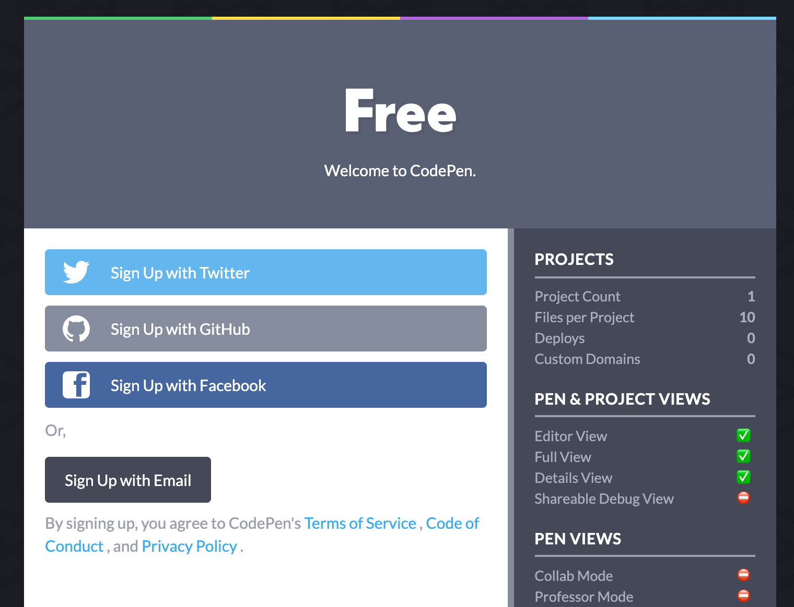
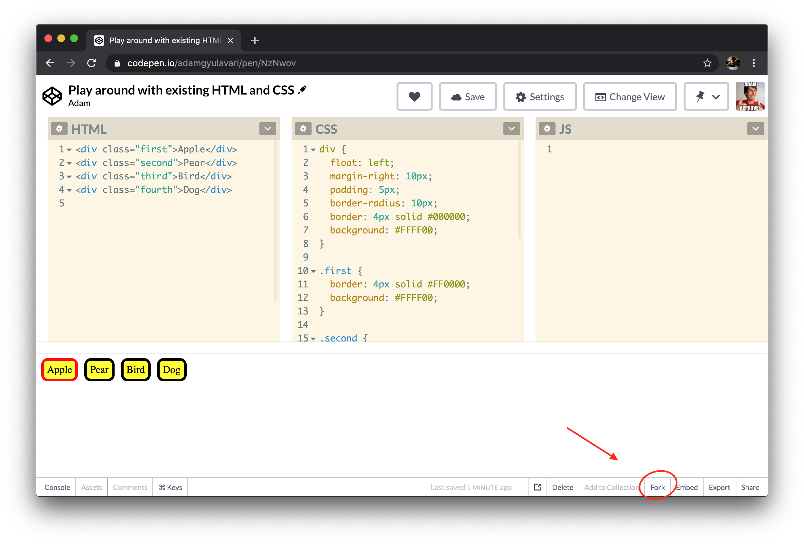
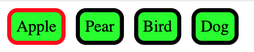

# Register and first exercise on Codepen

## Help

- Discord channel
- Forum

## 1. Sign up to Codepen

- Sign up to create an account on [Codepen](https://codepen.io/) so your work will be saved
- You can use simple email registration or another account, like Facebook
- After creating an account you can follow a quick tour of what can you do with Codepen, the first parts will be useful, so feel free to Leave the tour any time

## 2. Fork

- [Open this Codepen](https://codepen.io/adamgyulavari/pen/rNVqXrJ)
- Hit the `Fork` button at the bottom right, so you'll get your own copy under your account (and can save the modifications)

- Now that you have a forked codepen, follow the exercises below

## 3. Play around

- Modify the background color of the `yellow` buttons to be `lime`:

- Modify the background color of the second button only to be `white`:

- Modify the color of the border for the Dog's button to be `blue`:

- Add a fifth button with the text: `Human` that has `purple` borders and `yellow` background

