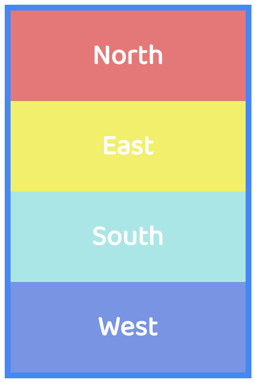
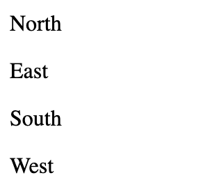
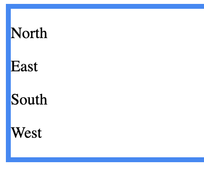
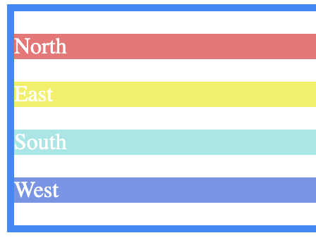
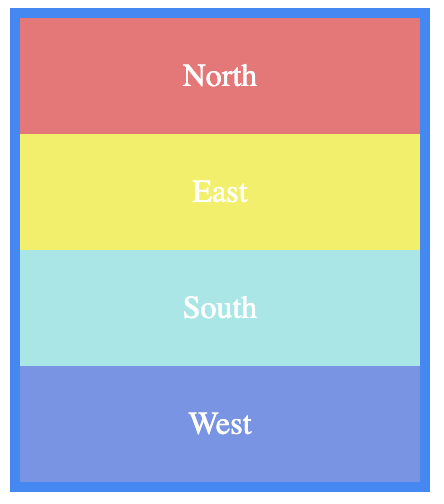

# Directions

## Help

- [Questions to this exercise](http://askbot.greenfox.academy/questions/scope:all/sort:activity-desc/tags:directionsfirst/page:1/)

## The Overview

- Create a new pen on Codepen to work with
- You'll create this step by step (but you can give it a try on your own):



## Step by step

Remember that in HTML everything is made up of boxes. Looking at the overview of the exercise, identify all the boxes that are present, so you can create the proper HTML structure. Boxes can be in boxes and they can be next to each other or below each other. Just like HTML elements in the code.

```html
<p>Two paragraph elements below each other</p>
<p>Two paragraph elements below each other</p>

<main>
  <h1>Header element inside a main tag</h1>
  <h2>Another header element inside a main tag</h2>
</main>
```

You can nest elements into each other almost anyhow, but mostly you'll put other elements into container elements (like `main`, `section`, `div`...).

You can see that the `h1` and `h2` elements' code is started at a different position than the `main`. This is called indentation. Just like in a Word document, you can indent texts to start 2 spaces from the beginning. This helps for you to see through the code what's inside what.

Header and paragraph elements usually are containing only simple text content, but sometimes they can contain `inline` elements. Headers and paragraphs are `block` elements, this is why they're stretching out to the whole area in width. So they create a line or block. As the name suggests `inline` elements won't stretch out to a whole line they'll just fit in the texts anywhere smoothly (eg. `em`, `strong`, `a`).

```html
<main>
  <header>
    <h1>This is the title inside of a header container</h1>
    <h2>And a smaller subtitle</h2>
  </header>
  <section>
    <h3>Title of the section</h3>
    <p>Text of the section with <strong>something very important</strong> and less important things.</p>
  </section>
</main>
```

As you can see the indentation really helps to see that all elements are in the `main` tag and it has only 2 elements in it directly a `header` and a `section`. It's a good practice to put all `block` elements on a new line and indent them 2 spaces further than their container parent elements. The `inline` elements can be put inline the code as well so it'll look similar to the result.

### Create the HTML structure with 4 `p` tags in a `main` container

- Note that the container element won't be visible until you style it



### Style the container with the proper border

- You can use this color: `#4285f4`



To be able to differently style the same tags you can use CSS classes. You can have as many as you want and even combine them on HTML elements. To add a class to an HTML element, use the `class` attribute on the opening tag.

```html
<p class="red">This paragraph will have the red CSS class.</p>
```

The classnames can be anything, but usually it's good to name them so you can remember what are their purpose.

Now you can create a CSS rule where for the selector part you can select the `red` class. To indicate that you're specifying a classname the dot `.` is required at the beginning of the classname. (Without it the rule would apply for the `red` tags, but there are no `red` tags)

```css
.red {
  color: red;
}
```

This rule is going to change the text color to red for any tag that has the `red` class.

### Add different classnames to the `p` tags and style their background and the color of the text

- These are the colors on the image:
  - North: `#E67676`
  - East: `#F2F062`
  - South: `#A9E6E6`
  - West: `#7692E4`



To center the text in a `block` element (luckily `p` is one) you can simply set the `text-align` property in a CSS rule to the `center` value.

```css
.centered {
  text-align: center;
}
```

### Style the margins, paddings, the width and center the text



Setting the text to be bold can be done by setting the `font-weight` CSS property. This property can have values of hundreds like `100` - `900` and these words: `bold`, `bolder`, `lighter` and `normal`.

```css
.bold-text {
  font-weight: bold;
}
```

Or you can use the `strong` inline tag to surround your text which is bold by default.

```html
<p><strong>Bold text without extra CSS rules</strong></p>
```

### Add font style and make them bold

- You can use any font you like, this one is `Baloo Thambi 2`
- The font size is `24px`


## [Solution Pen](https://codepen.io/adamgyulavari/pen/KKpEBKq)
