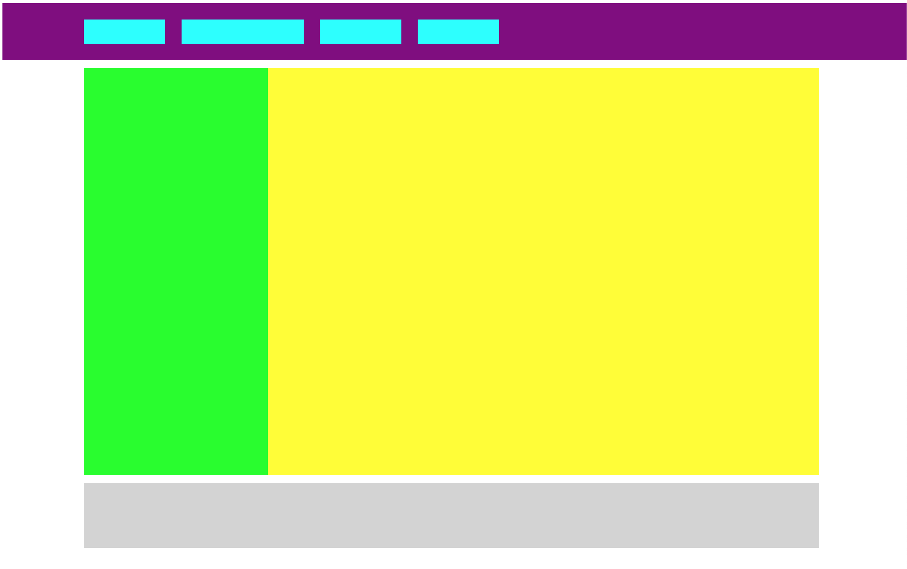

# Fixed header

## Help

- [Questions to this exercise](http://askbot.greenfox.academy/questions/tags:fixed-header/)

## The Overview

- Create a new pen on Codepen to work with
- You'll create this:
  - Colors are the same as before with `lightgrey`
  - The purple header is bit taller `70px` and sticks to the top if the content vertically scrollable
  - The margins on the left and right are `100px`
  - The footer is `80px` tall



## Building blocks

The exercise has very similar arrangement and elements as the previous exercise, feel free to copy elements and styles from there.

You'll need to `position` the header to make it stick to the top. The default value to the `position` property is `static`, which will work how all elements worked before. The `static` `block` elements are going to be under each other. You can position an element `relative` to it's actual calculated `static` position. You can position an element `absolute` to it's closest `relative` container element. And with `fixed` you can position elements to the screen's window. If you position an element you can use the `top`, `right`, `bottom` and `left` CSS properties to place the element where you want it to be. [Read more about positioning](https://developer.mozilla.org/en-US/docs/Web/CSS/position) if you're interested.

```css
header {
  position: fixed;
  top: 0;
}
```

Remember that in this case the `header` element is going to be moved out from the normal document flow of the elements. This means that the rest of the content will start from the top too (the green and yellow content part). They will need a top `margin`, so their top parts come out from under the `header`.

## [Solution Pen](https://codepen.io/adamgyulavari/pen/WNvWjLr?editors=1100)
