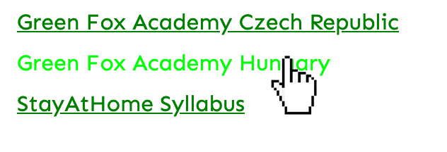
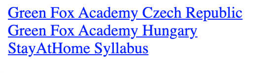

# Links to the web

## Help

- [Questions to this exercise](http://askbot.greenfox.academy/questions/tags:links/)

## The Overview

- Create a new pen on Codepen to work with
- You'll create this step by step (but you can give it a try on your own):
  - colors: `green` and `lime`
  - font: `Sen`



> Note: the hand is the mouse cursor, it's not part of the exercise to put there, just move your mouse over the text

## Step by step

Links are very important part of every webpage with them you can connect different parts of your page and also point to other websites.

To create a link in HTML, use the `a` tag with the `href` attribute.

```html
<a href="https://codepen.io">Codepen</a>
```

### Create 3 links in HTML pointing to different sites

- Green Fox Academy Czech Republic to https://greenfoxacademy.cz
- Green Fox Academy Hungary to https://greenfoxacademy.com
- StayAtHome Syllabus to https://stayathome-syllabus.greenfox.academy
- Don't worry if some of them are not `blue` but `purple` (you can easily color them `blue` if you want)


You can try clicking on them, they should be already working. Notice that they'll go to the linked website in the same preview window where you're working. You can change that if you want by using the `target` attribute on the tags with a `_blank` value. This way the links will be opened on a new browser tab and your editor and preview stays the same on the original tab.

```html
<a href="https://codepen.io" target="_blank">Codepen</a>
```

> Note: Opening browser tab or new window is an option in the browser's settings. The target="_blank" will open a new tab or window based on that and you can't change that in HTML

### Put them below each other

- You should use the `display: block` rule in CSS to put them in new lines, so you can create a little distance easily with `margin` in the next step



### Add `margin` and set the `font-family` for the `a` tags

- `10px` margin and `Sen` font is used from Google Fonts in the image


Coloring `a` tags work exactly the same as coloring other texts.

```css
a {
  color: blue;
}
```

But the `a` elements have a few special cases where they can look a little bit different. These special cases exist to help the viewer of the page visually. Modifying the link appearance when the viewer's mouse is over (`hover`) it will help the viewer to notice something is different here. The viewer can see that this whole text is a link and if the he or she clicks now this is what's going to be clicked. You can add a special case to any CSS selector by putting a colon character `:` after the selector and typing an existing special case.

```css
a:hover {
  color: lightblue;
}
```

But you can also help the viewer by coloring slightly differently the already `visited` links, and what the viewer is clicking on at the moment of the click (`active`). These special cases have default colors in every browser, but if you specify anything in your CSS, your rules will override the browser defaults.

```css
a:visited {
  color: purple;
}

a:active {
  color: red;
}
```

The colors in these examples are the browser defaults for most of the browsers (except for the `hover`, that's not specified).

The special cases officially called `pseudo classes` and they work with any tag or class selector you used before.

```css
main:hover {
  background: red;
}
```

There are a lot more than what we show you here, you can [check them out](https://hackernoon.com/understanding-pseudo-class-selectors-mg443t89) if you want, but some of them are pretty complicated.

### Add `:hover` style for the `a` elements

- The color used here is `lime`
- To remove the underline you can use `text-decoration: none;` rule


