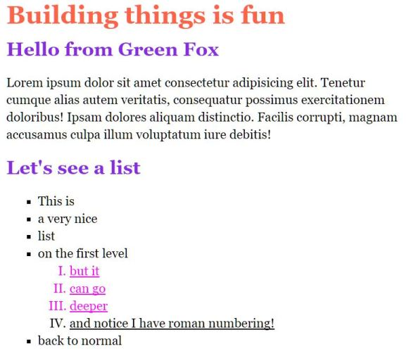

# Lists and texts

## Help

- Quenstions to this exercise

## The Overview

- Create a new pen on Codepen to work with
- Create the new HTML structure and apply the necessary styles



## Building blocks

### Lists

There are two types of lists in HTML: ordered and unordered. The corresponding tags are `ol` (ordered list) and `ul` (unordered list). Both of them can have `li` elements (list item) inside them. List items can contain simple texts or any complex tag structure inside them, like a whole other list. This is how you can create an inner level list.

```html
<ul>
  <li>First</li>
  <li>Second</li>
  <li>Third with inner list
    <ol>
      <li>inner item</li>
      <li>inner item</li>
    </ol>
  </li>
</ul>
```

Styling them is exactly the same as for other tags, but there are a few list specific properties that you can use. Try searching for these on Google with these keywords: `html list item change bullet`. There is going to be a lot of good results, probably even the first one. [Here](https://developer.mozilla.org/en-US/docs/Learn/CSS/Styling_text/Styling_lists) is a good one if your search was not successful.

### Step by Step guide

- Create the HTML structure with headers and a paragraph
- Create the list structure with the inner list
- Style the headers in CSS
- Assign classes to the styled list items (underlined and colored) in HTML
- Style the classes in CSS
