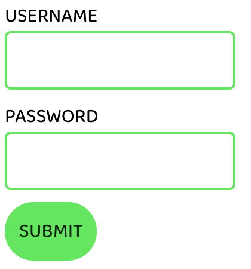
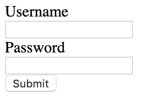
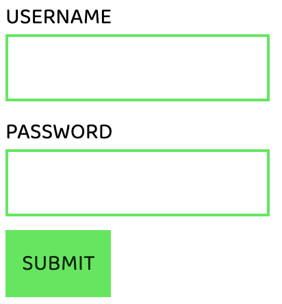

# Simple but stylish form

## Help

- [Questions to this exercise](http://askbot.greenfox.academy/questions/scope:all/sort:activity-desc/tags:simpleform/page:1/)

## The Overview

- Create a new pen on Codepen to work with
- You'll create this step by step (but you can give it a try on your own):



## Step by step

The `form` HTML tag is to hold together a form element like this. The forms can have any container elements inside of them or headers even lists, but there are special elements to use specifically inside forms. The `input` element is for creating a field where the user can give some input (eg. type username or select gender). Every input should have a `type` attribute to specify which kind of input the webpage waiting for. You can search on Google to check what different types are there, but the most common ones are `text`, `password` and `email`.

```html
<input type="text">
```

This is not very informative on its own, so usually it comes together with a `label` that can tell the user what to type in. Each element in the HTML structure can have an `id` property. This is a unique identifier for the element, so two elements can't have the same one. The label can be connected to the input in code using the `for` attribute with the value of the input's `id`.

```html
<label for="nameInputField">
<input type="text" id="nameInputField">
```

The last element that every form is going to need is the submit `button`.

```html
<button>Submit this form</button>
```

### Create the HTML structure of the `form`

- Note that by default the form inputs and labels are not `block` elements, so they'll sit next to each other in one line


In CSS you can modify any `block` or `inline` element to be the other instead with the `display` property.

```css
p {
  display: inline;
}

strong {
  display: block;
}
```

### Style the `input` and the `label` to be `block` elements



You can change the text in the HTML by modifying the content of the labels, but you can also make the appear with ALL CAPITAL letters with a CSS property. You can try to look it up on Google which one is that with these keywords `css make all caps` for example.

### Add colors, font, margin, padding



The HTML boxes usually have sharp corners, but the `border-radius` CSS property can easily change that.

### Round the corners for the `input`s and the `button`


