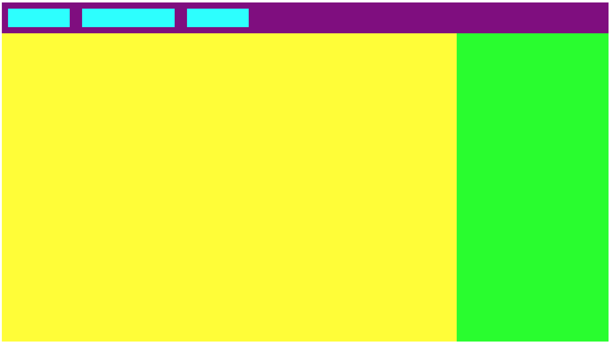

# A typical webpage

## Help

- [Questions to this exercise](http://askbot.greenfox.academy/questions/tags:typical-webpage/)

## The Overview

- Create a new pen on Codepen to work with
- You'll create this:
  - colors: `purple`, `cyan`, `yellow`, `lime`
  - Empty elements won't be shown unless you specify both width and height for them (which you can only set on `block` elements)
  - The example header is `50px`, the cyan items are `30px` tall and the yellow and green parts are `500px` tall



## Building blocks

You know everything to complete this exercise on your own. Imagine the boxes. What's in one row? What's in one column?

For the bottom part you can set the width to an exact number or percentage, but remember they are not going to be placed next to each other if they are `block` elements (and they should be `block` elements they are not simple texts to make them `inline`). The yellow and green part are in a `row` compared to each other, so you can put them in a container with a `row` direction. Then you can also use the `flex-grow` property on them so the two boxes will fill up the space on the main axis. In a `row` direction that means horizontally. You can set different values to the `flex-grow` if you want one of them to take more space than the other.

```css
.yellow {
  flex-grow: 4;
}

.green {
  flex-grow: 1;
}
```

By default in flexbox the elements will stretch to the end on the cross axis. In this case vertically. So if you set a height to the container of them they will become visible.

### Step by Step guide

- Create the HTML structure
- Pay attention to use correct tags for the purpose:
  - Purple is header or navigation
  - Yellow is the main content
  - Green is a side content
  - Cyans are links or buttons
- Style the backgrounds
- Add height to the header
- Add width and height to the links
- Use flex on the header and align the items to the center
- Add height to the container of the yellow and green part
- Add flex-grow to them

## [Solution Pen](https://codepen.io/adamgyulavari/pen/XWbQdpM?editors=1100)
