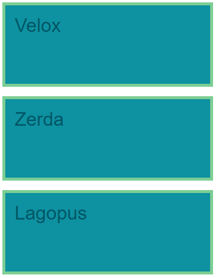

# Velox Zerda Lagopus

- Create a new pen on Codepen to work with
- You'll create this step by step (but you can give it a try on your own):

## Step by step

For this exercise you can choose to use almost any tags that can have a content. You should use the same tag for all 3 elements since the styling of them is the same.

### Create the HTML structure with `p` tags

There is another way to use colors than using the name of it.

### Create a CSS ruleset for the `p` tag and set the `background` to `#0d91a1`
