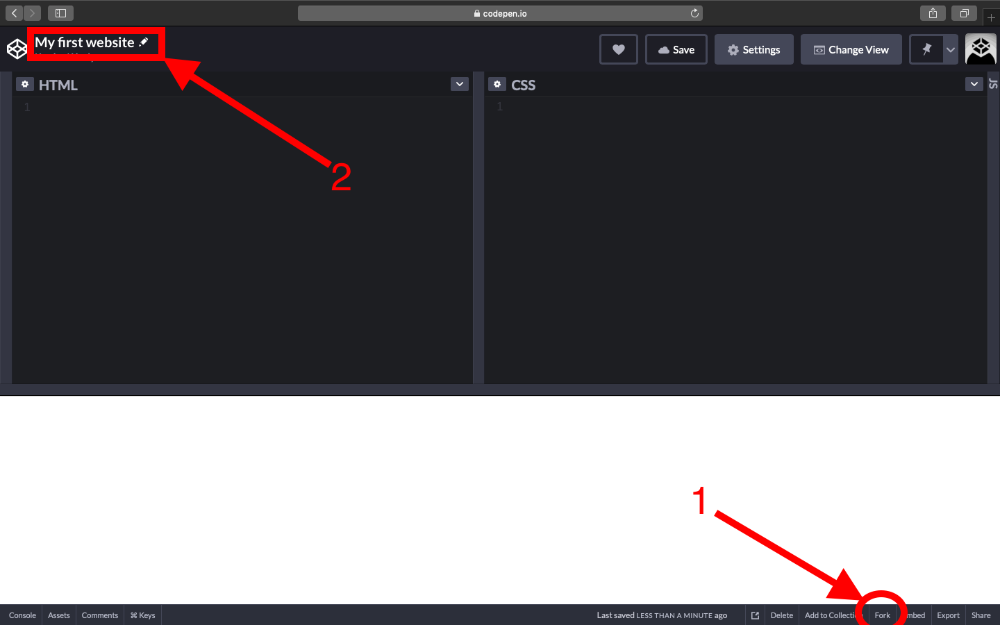

# My first website 2.0

*Please finish the first part before moving on.*

- Your task again is to recreate this [website](assets/full-page.png).
- You are already familiar with the CV. Now, with new tools, like layout, and advanced styling, in your hand, spice it up a little, and make it your own.

## Steps

- 1. Fork the *Pen* you created.

- 2. After the page loads the *copy*, rename the *Pen*.

- Modify the *html* and *css* parts to match the page at the top.

- Get at least **2 XPs** from the table below.

|         **Layout**      |      |
|:------------------------|------|
| Flexbox                 | 1 XP |
| Fixed positioning       | 1 XP |
|         **Design**      |      |
| pick your own colors    | 1 XP |
| pick your own fonts     | 1 XP |

- When selecting your own colors consider the contrast levels and visibility
- When selecting your own fonts consider to use only 2-3 at most and they should be visibly different

If you are stuck, consider these ideas:

- change the layout to have more than 1 column (eg. using flexbox)
- add navigation with links to the sections

Some ideas, if you are ready:

- modify the content to your own data
- pick new color combinations from here: <http://clrs.cc/a11y/>
- pick new font combinations from here: <http://fontpair.co/>
- check the [CV ideas](https://www.pinterest.com/hugabuga/cv-inspiration/) list for inspiration
