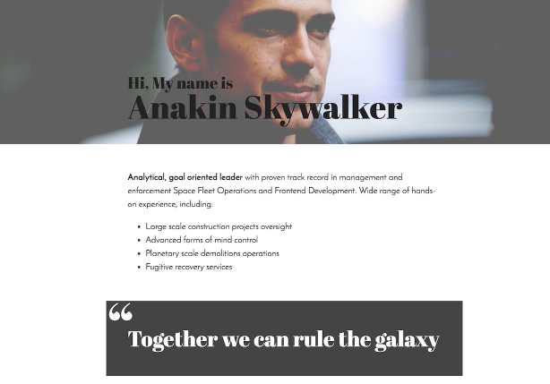

# My first website



- Your task is to recreate this [website](https://projects.invisionapp.com/share/X575YEGVU#/screens/155416515_Greenfox-Anakins-Cv).
- Try to make it as similar as possible to the design above.

## Steps

- **Create a new Pen.**
- **Start with the content.** Copy-paste the text content from [here](assets/cv.md) to start with.
- **Give it some structure.** What semantic role do these paragraphs fill?
  Divide it into a few separate HTML tags. Look up what the `<blockquote>` element is for and use it.
- **You can use [this](assets/first-website-header.png) image in the header.**
- **Add in style.** Start with basic text styles, like size, color, margins, line-height.
  How do you center content on the page? Add fonts:
  - header and qoutes: 'Abril Fatface' font, #222 grey
  - paragrpahs: 'Josefin Sans' font, #222 grey
  - subtitles: 'Merriweather' font, 15px, italic

If you are ready, move on to the [next part](my-first-website-2.md).

## Building blocks

Though it looks all complicated at first sight, if you look at the whole structure of the page you can see that it is only one column of elements. There are a few tricky parts though but the header, paragraphs, lists, quotes are all coming below each other as separate boxes. You can just use simple tags you've learned to display them and put them into the HTML one by one, but you can group them if you want with [semantic elements](https://developer.mozilla.org/en-US/docs/Glossary/Semantics#Semantic_elements). These won't do anything special, just like `div` or `section`. They are used to group elements in a container.

### Text on the image

There are multiple ways of putting text on the image, you already know about positioning the elements. You can use `absolute` position on the title to achieve this (remember, the absolute positioning happens inside a `relative` positioned container). But you can also set an image to the background of any box. In this case you'll have to set the `width` and `height` for the box too, because just like with background colors it is only the background. And the box size is based on the content's size, not on the background's. You can read more about [backgrounds here](https://developer.mozilla.org/en-US/docs/Web/CSS/background).

### Quotes with `„` lower quotation mark

For this you can use positioning again if you have one element that contains only the `„` sign. You can position that `absolute` inside the grey box.

But there's more advanced way of doing this. The quotation mark is not really part of the content, so it shouldn't be in the HTML at all. In these cases you can put the sign into the CSS using `pseudo elements`. There are many of them for many use-cases. If you remember `pseudo classes` are selectors for special states (like hover or active) of the elements. The `pseudo elements` are selectors for special parts of the elements. Like the `first-letter` or `first-line`. So you can style them different than the rest of the element. You can [learn about them all here](https://developer.mozilla.org/en-US/docs/Web/CSS/Pseudo-elements), if you'd like to. But in this exercise we can use the `before` pseudo element. It is an empty and invisible element by default that every HTML element will have before itself. You can set the content of it from CSS (and style it of course), so it is perfect for this scenario. You can use `pseudo elements` in CSS similar to the pseudo classes, just instead of a simple colon `:` character, you need two of them `::` and then the name of the pseudo element.

```css
blockquote::before {
  content: '„';
  /* then the styling */
}
```
