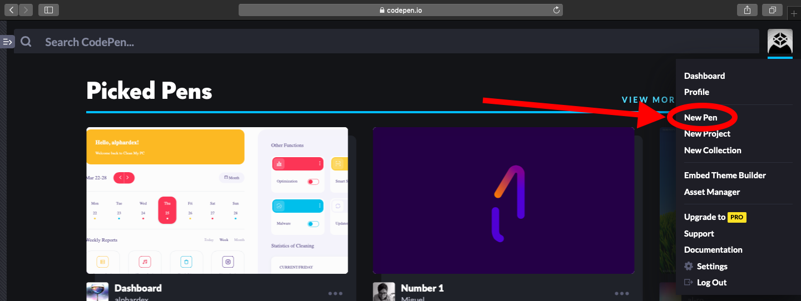
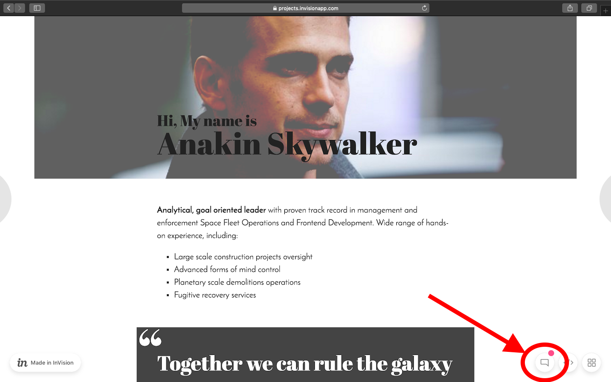

# My first website

- Your task is to recreate this [website](https://projects.invisionapp.com/share/X575YEGVU#/screens/155416515_Greenfox-Anakins-Cv).
- Try to make it as similar as possible to the design above.

## Steps

- **Create a new Pen.**

- **Start with the content.** Copy-paste the text content from [here](assets/cv.md) to start with.
- **Give it some structure.** What semantic role do these paragraphs fill?
  Divide it into a few separate HTML tags. Look up what the `<blockquote>` element is for and use it.
- **Use [this](assets/first-website-header.png) image in the header.**
- **Add in style.** Start with basic text styles, like size, color, margins, line-height.
  How do you center content on the page? Try adding a custom font via
  [Google Fonts](https://www.google.com/fonts) based on the comments on the
  design.

If you are ready, move on to the [next part](my-first-website-2.md).