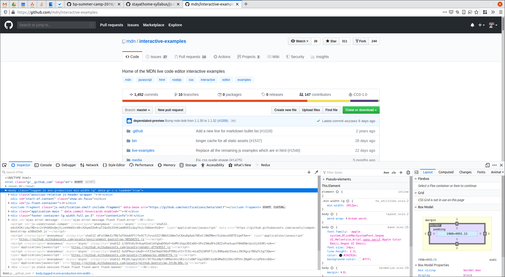
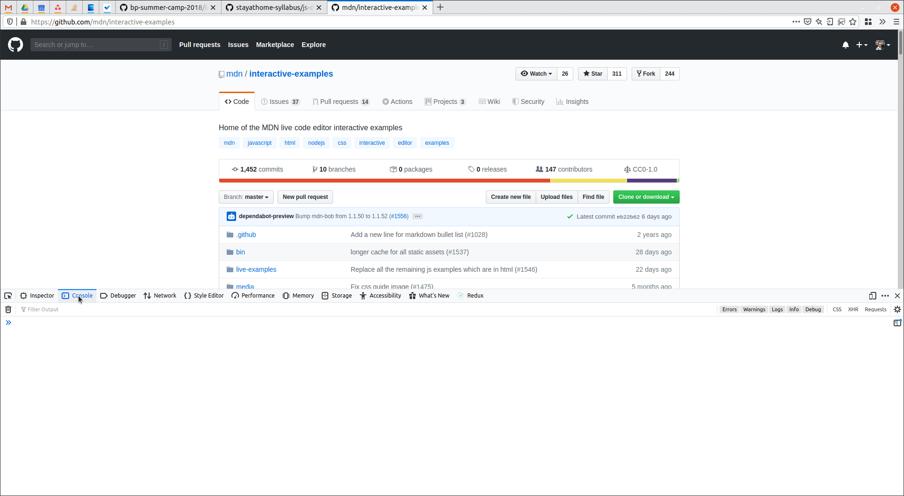
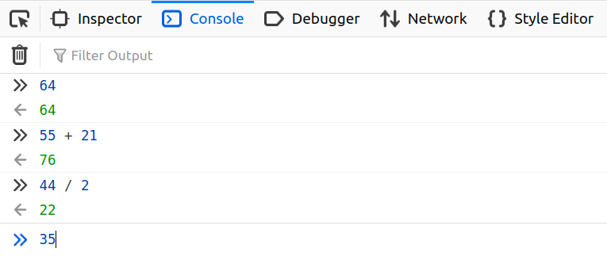

# Console in the browser

> The console is a tool in the browser where you can run JavaScript code
> quickly. Also, it is used to print warnings and error messages so you will
> know what is going on in your application.

The console is part of the developer tools, so first you will need to launch the
Dev Tools, You can do this by many different ways, based on your operating
system and browser. Some of the common options are

- Pressing the `F12` button
- Right click on the page then `Inspect Element`
- You may find related options at the menu bar of your browsers as well.

There are many functions within the developer tools, but we will focus only on
the console, so lets navigate there.

You can look at the console like a playground, you can test your JavaScript code
manipulate the webpage itself or just use it as a calculator.

Lets try it:

- Just input any number and press enter
  - You can see the entered number in a new line
- Add two numbers and press enter
  - You should see the result in a new line

> Later you will want to print something into the `console` to see if everything
> works well. For this you will need to use `console.log(something)`.
> For example console.log(5) in your code will print 5 into this console.
> We use it pretty often during development.
