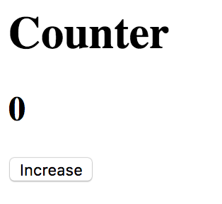

# Counter

- Replicate the basic HTML above (2 different headings and a button)
- Create an `EventListener` for clicking on the button, increase the value of
  the second heading (currently `0`)
- (Optional) Create a working decreasing button as well
