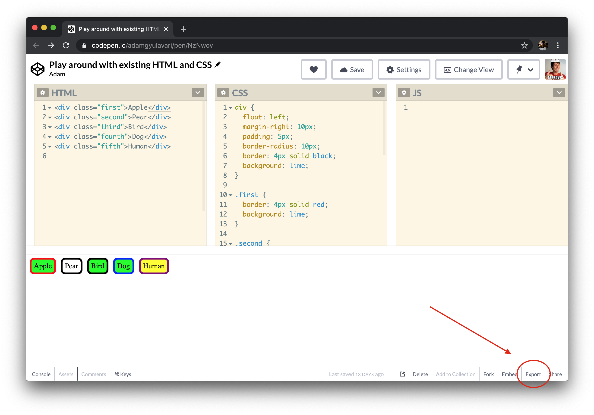
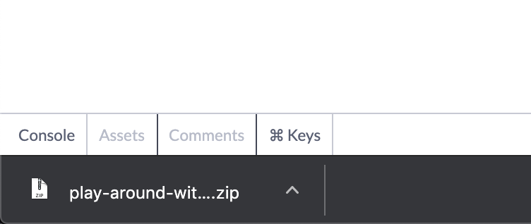
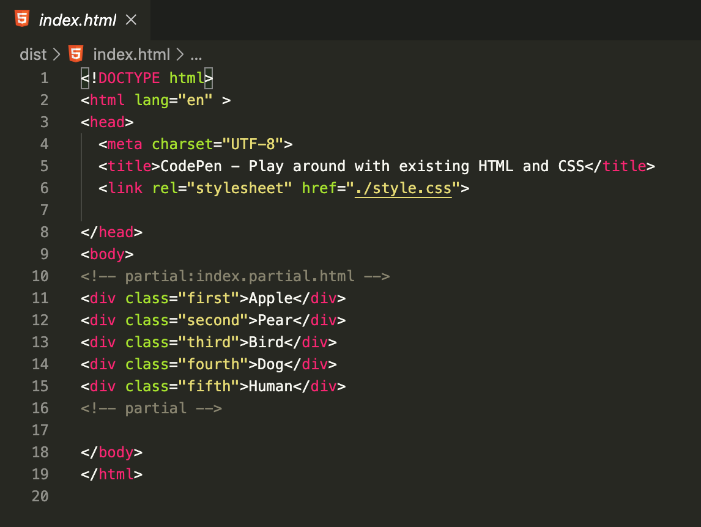
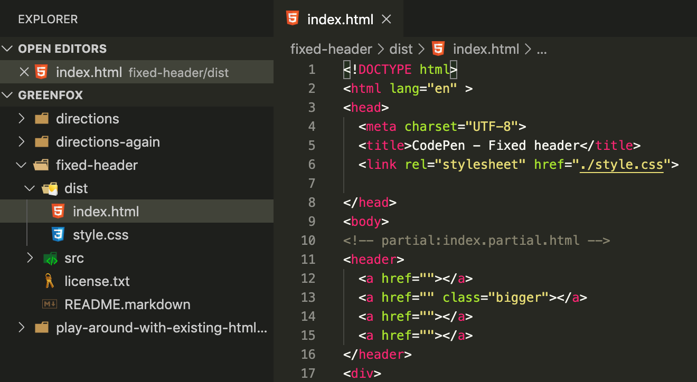
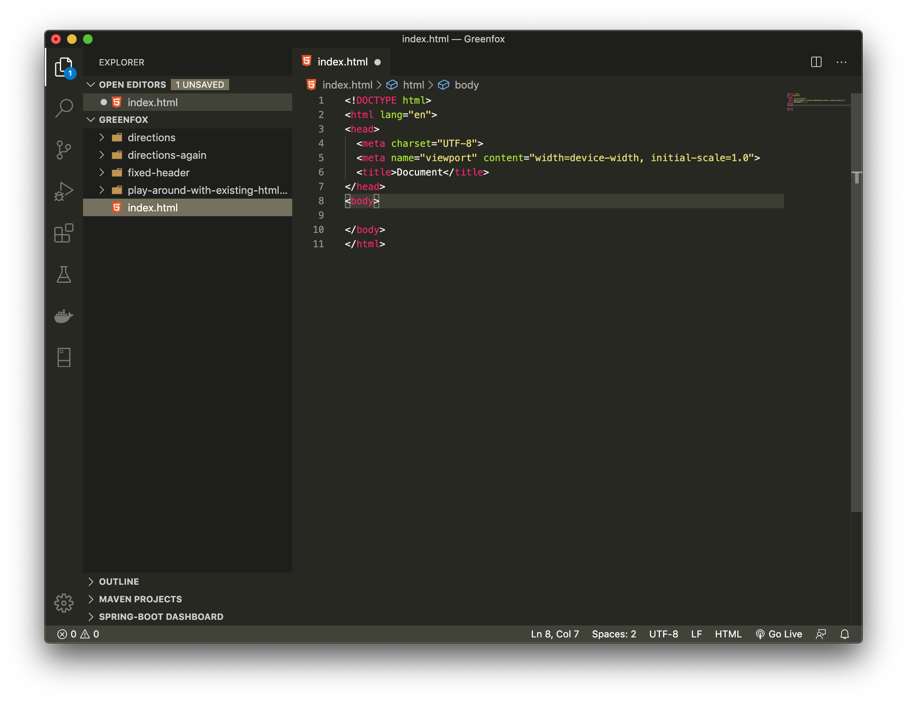

# Download your pens

## Help

- [Questions to this exercise](http://askbot.greenfox.academy/questions/tags:download-pens/)

## The Overview

- Export all your pens
- Extract the zip files into your Greenfox folder in separate folder for each exercise
- Open them in VS Code and with Live Server
- Create in `index.html` in your Greenfox folder and link all the downloaded exercises

## Step by Step

You can easily download your existing solutions from Codepen using the `Export` button at the bottom right of the page. After clicking on it you can select the `Export .zip` to download your HTML and CSS files in a zip package.



### Export your first pen (any of them)

- This can look different in other browsers, but you can find it in your downloaded files



After downloaded, you can extract the zip package. If you're using Google Chrome you can just click on the downloaded file on the bottom. If you use other browsers just find it in your downloads. On Windows this will open the zip file and you can copy the content to any folder you like. On a Mac it will extract the content automatically in a folder where the downloaded file is and then you can copy or move it anywhere you like.

It is a good idea to have every Greenfox related files and folders under your previously created `Greenfox` folder (that is already opened in VS Code). So change to VS Code, create a new folder in the Greenfox folder for the pen you've downloaded (eg. `play-around`). Then copy the files and folders from the zip file into this folder. There should be 2 files and 2 folders in the zip file:

- `dist` (a folder)
- `license.txt` (a file)
- `README.markdown` (a file)
- `src` (a folder)

### Create a folder in `Greenfox` folder for the exercise and copy the content of the zip file into that

If you moved the files, then switch back to VS Code to check out the contents. You can check the content of the license and the markdown, but your code is going to be in the `dist` folder. You should see a `style.css` there with the content of the CSS part from codepen and an `index.html` file with the content of the HTML part. The HTML part is surrounded with a valid HTML structure as you can see on Codepen you've only edited an HTML file's `body` part (the part between the comments).



Here's mine so you can have a comparison (I have a different color theme than the default, but you can change that too in the settings of VS Code on the bottom left). You can see that the `title` tag is set in the `head` properly. That's going to be the title of the page, displayed on the browser tab. You can also see that the CSS file is loaded with the `link` element.

Now you can open the `index.html` with Live Server by right clicking on it and selecting Open with Live Server.

### Download more pens and place them in the `Greenfox` folder

- I've downloaded these exercises for the example image below:
  - directions
  - directions-again
  - fixed-header
  - play-around
- Note: your Greenfox folder will contain the `vscode-practice` folder too



You can check that all of them has the same `dist` folder and all of those should have an `index.html` and a `style.css`.

### Create a new `index.html` in the `Greenfox` folder with an HTML structure



Don't worry if you created the file in the wrong place, you can move it around by drag-and-drop, or you can also open this folder in your system and copy and paste as you would usually copy or move files.

Now you can create links for your previous exercise solutions. So far you only created links with full URLs. Now we'll use just part URLs, or relative URLs. They work similar, just the `href` attribute's value will be a bit shorter. Relative means they should be relative where the link is. Your link is in the `Greenfox` folder in that `index.html` file, so you can create a relative link to one of the exercises using the path that leads to that from this folder. For example `directions` -> `dist` -> `index.html`. In the path you need to use the forward slash `/` between the parts:

```html
<a href="directions/dist/index.html">My solution to the Directions Exercise</a>
```

The `index.html` is the default file to be loaded from a directory, so that is not necessary, this will work too: `directions/dist`.

### Create links for all your downloaded exercises
