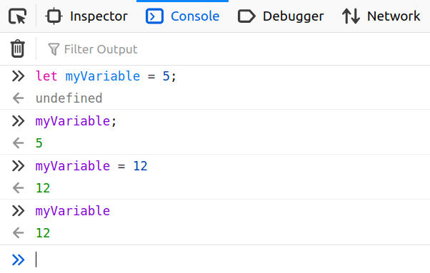

# Variables, Types and Expressions in JavaScript

Now we are going to get familiar with variables, types and operators. These are
the really fundamentals in programming languages, not only in JavaScript,
however their usage or syntax can slightly vary.

> Note: Now I will show you how these *language constructs* work instead of
> doable exercises. I suggest you to repeat and play around with everything what
> you learn in the console. Later on we will see other options to run/execute
> JavaScript code.

## Comments

In programming languages we have the opportunity to add comments to our code.
This makes easier to understand complicated parts or for example to add notes
during learning. Commented lines start with `//` or are between `/*` and `*/`.
The commented code wont get executed, it is only for the reader.

```js
// this is an inline comment, the browser will ignore it

/*
  this is a multiline comment
  the browser will ignore the whole block
*/
```

## Variables

In the previous part you have entered some *value* in the console, then made
an *operation* (+) with them. Now we will learn about *variables*.

A variables is actually a name-value pair and can be defined/declared with
several different keywords. In this workshop we will use `let`.

```js
let variable;
let otherVariable;
```

Above we have created two variables, their names are `variable` and
`otherVariable` respectively. Currently they have no value assigned.

If you want to a assign a value to your variable, you will need to use the `=`
operator:

```js
let myVariable = 5;
```

> **Important**: If you try to declare two variables with the same name
> (redeclaration), then you will get an error. In this case you need to ignore
> the *let* keyword or use another variable name.

After a variable has been declared you can change its value any time with the
`=` sign:



> **Extra info**: You can use `const` and `var` for variable declarations and
> all these 3 behaves differently. `let` is perfectly enough for us now, but you
> can read about them in the most referenced [documentation][mdn-declarations],
> maintained by Mozilla and the community.

## Types

Now after we know what are variables, lets examine what can be their values. As
we've seen earlier, we have numbers for example. Is this enough for us?
Nope, except if we want to create a calculator, but as the application gets more
complicated we will need more types. In JavaScript we have 7 different primitive
(basic) data types, but we will learn about only 3 of them:

- **number**: any number, both integer and rational numbers
- **string**: they represents any text or a single character
- **boolean**: it has two values *true* or *false*

### Boolean

Lets start with the simplest type, Boolean. It is a pretty common type and we
have it in almost every language. It has only two values `true` or `false`.

```js
let myBoolean = true;
let myOtherBoolean = false;
```

#### Operators

Operators which can be used with boolean values are called `logical operators`
the most common ones are `or` and `and`.

##### and (`&&`)

To understand the *logical and* operator we can use a table

| value1 | value2 | result |
| :----- | ------ | -----: |
| true   | true   | true   |
| true   | false  | false  |
| false  | false  | false  |

So in a nutshell logical *and* will result true only if both values are true

```js
let result = true && true;
// result equals to true

let result2 = true && false;
//result2 equals to false
```

##### or (`||`)

*Logical or* is pretty similar to the *and*, but its result is always true if
at least one operand is true.

| value1 | value2 | result |
| :----- | ------ | -----: |
| true   | true   | true   |
| true   | false  | false  |
| false  | false  | false  |

```js
let result = true || true;
// result equals to true

let result2 = true || false;
//result2 equals to true

let result3 = false || false || true || false;
// result3 equals to true

let result4 = false || false;
// result4 equals to false
```

##### not (`!`)

`Not` is a *unary* operator which means it has only one operand. It simply
negates the value.

```js
let result = !true;
// result equals to false

let result2 = !false
// result2 equals to true
```

What do you think what will be the result of `!!true`? Lets try it and find out
why did you get that result.

##### equals (`===`)

With the equals operator you can check if the operands are equals or not.
This operator can be  used with all the other types but will always result
a boolean.

```js
let result = true === true;
// result equals to true

let result2 = true === false;
// result2 equals to false

let result3 = false === false;
// result3 equals to true

let result4 = 5 === 5;
// result4 equals to true
```

> Note: there is an other equals operator `==` which works almost the same way,
> but in some cases they will have different result. As a good practice we
> encourage everybody to use the triple variant.

##### not equals (`!==`)

The *not equals* operator is the counterpart of the equals, you can check with
it whether two values are different or not.

```js
let result = true !== true;
// result equals to false

let result2 = true !== false;
// result2 equals to true

let result3 = 1 !== 2;
// result3 equals to true
```

### Numbers

We have already worked with numbers in the previous exercise. They represents
anything between `-Infinity` and `Infinity` and you can do any operation with
them what you already did in the elementary school.

> **Extra info**: Some languages have specific types for rational numbers but
> in JavaScript there is only `number`, regardless to its value.

#### Operators

Just like in the math you can do different operations with numbers. In the
previous exercise we have seen the addition (+), now lets checkout some other
*operators*.

##### subtraction (`-`)

Subtraction works the same way as in math, you can try it out in the console.

```js
let result = 5 - 6;
// result equals to -1
```

##### multiplication (`*`)

There is no surprise with multiplication either:

```js
let result = 5 * 6;
// result equals to 30
```

##### division (`/`)

Division is almost the same too, but there is a slight difference. In math,
you cannot divide by zero. In JavaScript you can get an interesting result.

```js
let result = 10 / 4;
// result is 2.5

let result2 = 10 / 0;
// result2 is -Infinity
```

##### modulo (`%`)

Modulo is less known but we do have it in math too. With modulo you can get
the reminder of a division.

```js
let reminder = 5 % 3;
//reminder is 2;
```

#### Exercises

- Calculate your age using the console
- How long was the WW2?
- How much would you need to pay for 76 Tesla shares?
- How many seconds in a day?
- What percentage of the world's population is hungarian?
- How much bigger is china than the czech republic
- If only 7 people can fit into a discord channel and we have 654 participants,
  than how many people will be in the smallest channel?

### Strings

Strings represents any text or character in programming languages, you just need
to use quotation marks such as `'` or `"`.

```js
let myString = 'This is a string';
```

We have a special form of strings as well, called *string template literal*.
We use them, when we want to make something dynamic. For this you will need to
use some more special characters:

```js
let name = 'Mark';
let greeting = `Hello ${name}!`;
// greeting equals to "Hello Mark!"
```

> Mind the special characters, we used the backtick ``` ` ``` instead of simple
> quotation marks and surrounded the variable with `${...}`

#### Operators

There are several operation what can be performed on strings but we will focus
only on two of them.

##### Concatenation (`+`)

With the `+` sign you can append/concatenate a string to another

```js
let greetWorld = 'Hello ' + 'World!';
//greetWorld equals to "Hello World!"

let name = 'Dave';
let greeting = 'Hello ' + name + '!';
// greeting equals to "Hello Dave!"
```

> As you can see the result is the same as with *string template literal*s,
> these template literals are pretty in JavaScript and preferred over the
> concatenation

##### Length (`.length`)

Strings in JavaScript have a property, called `length`. With this property you
can get the count of characters in the string.

```js
let charCount = 'Hello'.length;
// charCount equals to 5
```

What do you think, how many characters do we have in "Hello world"? Let's try it
and think through the result.

### (Optional) Weakly typed programming languages

JavaScript is a weakly typed programming language which means it will convert
types in order to successfully perform an operation.

```js
let result = 'apple' + 5;
// result equals to "apple5"
let result2 = '122' - 1;
// result2 equals to 121
```

Also, it is not possible to define a type for a variable, you can change its
value anytime meanwhile in other languages you cannot do this. If you say that
`myString` is a string then you are not allowed to assign a number to it.

However, this is valid in JavaScript, it is highly recommended to avoid:

```js
let myVariable = 5;
myVariable = 'apple';
```

## Data structures

Now we are pretty familiar with variables and their possible values,
unfortunately they are still not enough to build complex systems so we need to
extend our knowledge. Lets move on and see how can we compose complex structures with our primitive types.

### Array

Arrays are like a set of boxes. You can put something into each box
and then you can access the boxes by their index (order).

```js
let myArray = [3, 5, 6, 2, 22];
// myArray[1] === 5
```

> **Note**: Array indexes are zero-based, the first index is 0

There are no restrictions about the values, you can create *string*, *number*,
*boolean* or even mixed arrays.

```js
let myArray = ['Claire', 'Mark', 'Susan'];
let myOtherArray = [3, 12, true, 'Hello'];

// Access value by index
console.log(myArray[0]); // prints "Claire"

// Change the value in a box
myArray[0] = 'Peter'; // replaces "Claire" with "Peter"

// Count of the boxes
console.log(myArray.length); // prints 3

// Add a new box with specific value
myArray.push('Julia'); // adds Julia with a new index

console.log(myArray.length); // prints 4
```

> **Extra Info**: Arrays are powerful and there is a wide [list of actions][mdn-arrays]
> you can perform on them.

#### Exercises

- Create an array with random names
- Check if the 3rd name is longer than 5 characters
- Add one more name to your array
- Replace the first element with your name
- Check if the array's has more items than 4

### Object

Objects are again sets of boxes, but here you can access the boxes by their
names (*key*). Objects are used to describe real life entities like a facebook
post, which has a "content", "author", "date" and other attributes.

```js
let post = {
  author: "Bill Gates",
  content: "Online communication will change how companies work",
  date: "2020-04-01 18:06",
};

// You can access the values by their names, two syntaxes can be used
console.log(post['author']); // prints "Bill Gates"
console.log(post.author);    // prints "Bill Gates"

// Objects are dynamic and you can add new boxes anytime
post.likes = 11043;
console.log(post.likes); // prints 11043
```

#### Exercises

- Create an object which has a field called colors
  - The colors field should be an array containing random colors
- Add one more field to the object, named hasManyColors
  - Its value should be `true` if there are more colors than 3, otherwise it is
    expected to be `false`

> **Note**: We have more *data structures*, but these two are the most
> fundamental. They can be found in almost any programming language sometimes
> with another name.

After you are familiar with everything above and you've tried them out you can
move on to the next exercise.

[mdn-declarations]: https://developer.mozilla.org/en-US/docs/Web/JavaScript/Reference/Statements#Declarations
[mdn-arrays]: https://developer.mozilla.org/en-US/docs/Web/JavaScript/Reference/Global_Objects/Array