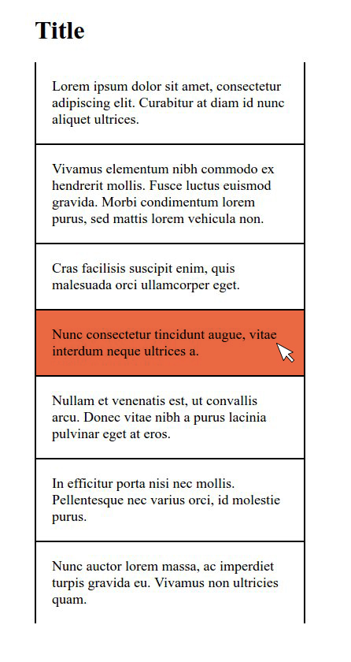

# Practice pseudo selectors

## Help

- [Questions to this exercise](http://askbot.greenfox.academy/questions/tags:pseudo-selectors/)

## Create the following layout

- If you move the mouse over a box, it should be highlighted

