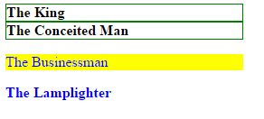

# Simplest selectors

## Help

- [Questions to this exercise](http://askbot.greenfox.academy/questions/tags:simplest-selectors/)

## Practice CSS selectors

Using this HTML structure:

```html
<div class="container">
  <div id="b325" class="asteroid">The King</div>
  <div class="asteroid b326">The Conceited Man</div>
</div>
<p class="asteroid big">The Businessman</p>
<div class="asteroid b329 big">The Lamplighter</div>
```

Do the following:

- Make 'The Businessman' and 'The Lamplighter' blue colored
- Add 'The King' and 'The Conceited Man' a 1 pixel wide green border each
- Make 'The King', 'The Conceited Man' and 'The Lamplighter' bold
- Add 'The Businessman' a yellow background

Use one ruleset for each and try to find the simplest selectors to achieve the necessary style. (Remember, you can use multiple selectors for one rule separating them with a comma `,`)


