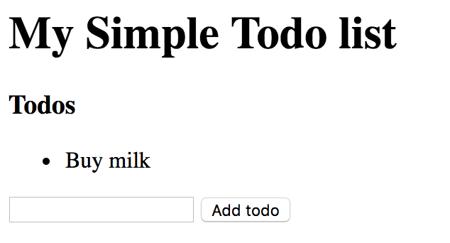
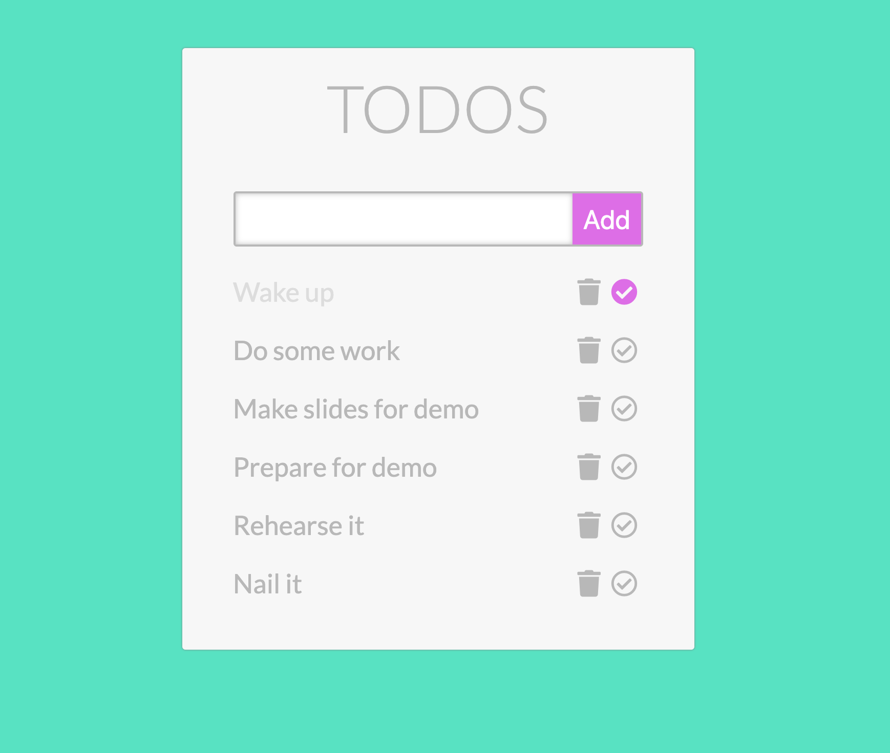

# Todo list



- Replicate this basic HTML file above
- When clicking on the `Add todo` button add the content of the input field to the list
- (Optional) Clicking on a list item should make the text line-through

## Todo Advanced (Optional)

- Make your Todo list more beautiful
- Use fonts, colors and layout
- Have a button for completing the todo
  - When clicking on it, change the display of the todo item (crossed over, different color, etc...)
- Have a button for deleting the todo
  - When clicking on it, remove the whole todo item (with it's buttons)



- You can use simple `img` tags for the icons, find cool icons at: http://iconfinder.com/ (prefer SVG-s since they are resolution independent)
- Or use https://fontawesome.com
- When adding a new todo, remember you have to add the buttons too. This means you have to set up the `click` handling there as well.
  - You can solve this with the help of creating id-s for the todos and the buttons like (`todo-1`, `button-1`)
- But you can set up the `click` handling for any completing or deleting button in general
  - In this case you can set up handling the `click`s for the container element of the todos (eg. `.todos-container`)
  - And specify what you're interested in with another selector (eg. `.delete-button`)
  - With this general approach you'll need to know which one button was clicked and
    inside a click handler you can tell that by using `$(event.target)` (where `event` is the input of the function):

```js
$('.todos-container').on('click', '.delete-button', (event) => {
  $(event.target).text('This button was clicked');
});
```

- You can read more about how this works [here](https://api.jquery.com/on/)
