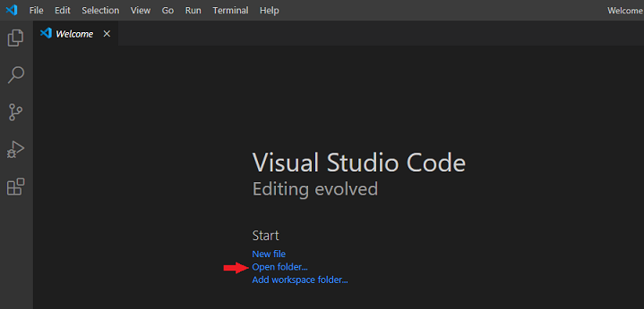
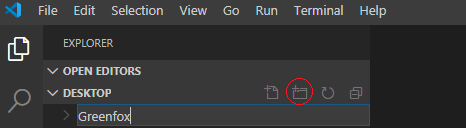
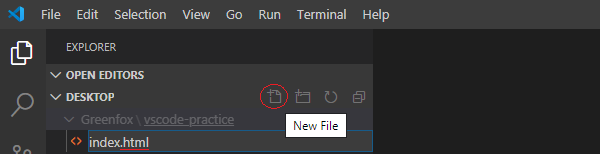
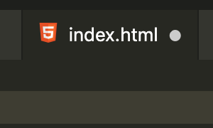
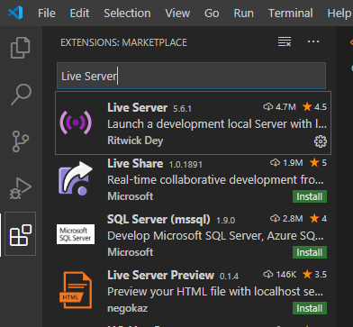

# Visual Studio Code first steps

> You will be introduced to the VS Code editor on how to create HTML, CSS files.

## Help

- [Questions to this exercise](http://askbot.greenfox.academy/questions/tags:vscode-first/)

## Step by step

Visual Studio Code (don't mix it up with Visual Studio, that's a different program) or VS Code for short is a text editor. It means you can create and edit text based files with it on your computer. Source codes are usually text based files. In case of HTML files they will contain HTML code. Or in case of CSS files they will contain CSS code. So from now on instead working on Codepen with HTML and CSS tabs, you can work on your machine in an HTML file and a CSS file.

### Folder structure

Run VS Code and open a folder where you would like to work. (Documents, Desktop, etc.)



Create a new folder and name it as **Greenfox**.



Make one more inside the **Greenfox** folder and name it as **vscode-practice**.

### Create new files

Create an `HTML` and a `CSS` file in the **vscode-practice** folder.

- For the sake of simplicity you can name these files like
  - `index.html`
  - `style.css`
- When you create a new file, make sure you give the correct extension! (.html, .css, .txt, etc.)



VS Code is automatically highlights your code if you used the proper file extension. When a file is opened you can check what VS Code is highlighting in the bottom right corner. If you've opened an HTML file, you should see HTML, if you've opened a CSS file, you should see CSS (you can also change the type of the highlighting by clicking on this).

### Edit files

- Click on the `index.html` to open it, it should be an empty file
- Start typing *html* and a pop-up window will appear
  - Select the `html:5` option (you can select it with a mouse or use the arrow up and down keys and hitting a `TAB` or `Enter` key)

```html
<!DOCTYPE html>
<html lang="en">
<head>
  <meta charset="UTF-8">
  <meta name="viewport" content="width=device-width, initial-scale=1.0">
  <title>Document</title>
</head>
<body>
  
</body>
</html>
```

This is the standard structure of an HTML file. The first line is a statement about the type of the file, then comes an opening `html` tag. Any other tags and elements are going to be inside that one single `html` element. This element has two elements inside: `head` and `body`. The `head` element contains information about this page and the `body` is going to be what you've already created on Codepen many times. The actual content that can be displayed in a browser.

- Add a `<p>` tag inside the body with some text
- Add this reference line in the HTML's `<head>` to include CSS

```html
  <link rel="stylesheet" type="text/css" href="style.css">
```

Luckily the CSS file doesn't have any container structure like the HTML, so you can just put your CSS rules into one.

- Click on the `style.css` and add some basic CSS like:

```css
p {
  color: red;
}
```

### Check in your browser

You can open your `index.html` with your browser, and you can see your HTML page. You should see your red text.

- If something is wrong, check that you saved all the files you've edited before!
  - You can tell if your file is not saved when there's a circle next to the name of it in the tab
  - VS Code doesn't save your changes automatically, you should click on **File -> Save**, or use the shortcut (on Windows is **Ctrl+S**, on Mac **Cmd+S**)



- If you don't want to save manually your changes all the time:
  - Go to **File -> Preferences -> Settings**
  - **Search settings** and write in: *Auto Save*
  - Choose the option that works for you (afterDelay - save after a few seconds, onFocusChange - save when you click outside the editor, onWindowChange - save when you change to any other window / program)

Change the content and the colour, and check it again! If you didn't close the browser, all you have to do is refresh the page.

### Live Server

> You get a lot of opportunities with VSCode to customize it according to your needs.
> It has a marketplace where you can install several extensions.
> That is what we're going to do!

We install an extension called 'Live Server' which has the advantages of:

- Open an HTML file to browser from VS Code
- Don't have to refresh the page all the time, it refreshes in real time after saved changes (just like Codepen's preview)

To install an extension, you need to go to the `Extensions` section in VS Code by clicking on the list icon on the top left. Then you'll see a search field and a list of your installed extensions and some recommendations. Search for the Live Server extension by typing it into the search field. To install it, click on the green Install button.



After installation you can navigate back to your opened folders and files by clicking on the first icon on the top left. Now you can easily open any HTML file by right clicking on it's name and selecting Open with Live Server. Make some more changes, check how it works.


