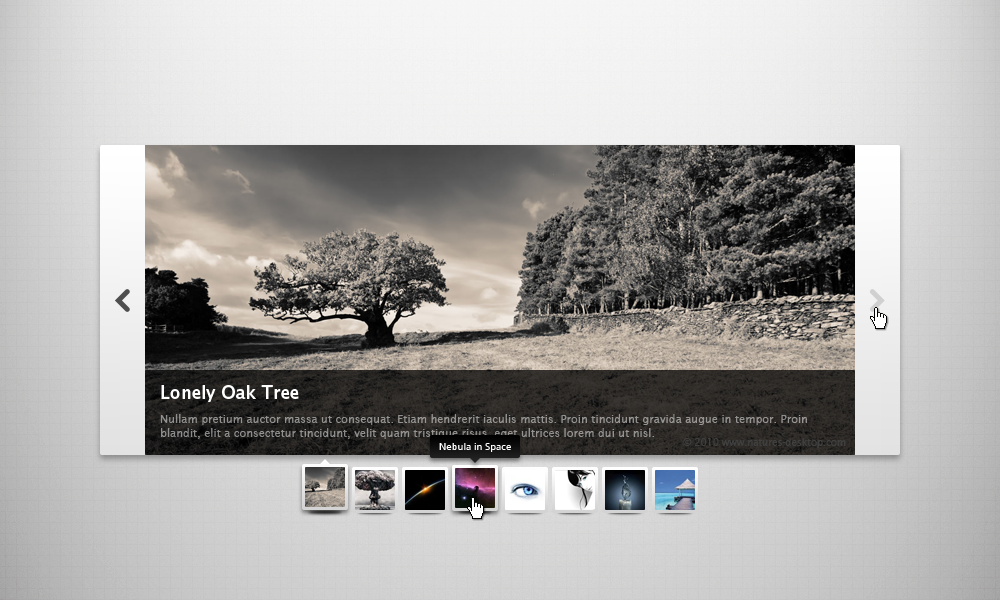

# My first web application

This week you'll work on a small web application that works similar to an image slider and displays images with their titles and descriptions.

## The overview



### Before you start to code

- Imagine what you have to do
- Create sketch-up(s) to help plan your HTML and CSS
- Figure out gallery data structure to store the necessary data in Javascript
- Think of what can be reused and plan them as functions and variables
- Prepare your user events

### Layout and behaviour specification

- You can change the desing if you want, but the point is that it should be looking nice
- It should be in the middle of the screen, with fixed size
- The gallery's content should be divided into two main parts: to the photo
  viewer and to the thumbnails.
- The photo viewer block should contain the two arrow buttons on the sides and
  the currently chosen photo in the middle.
- The thumbnails part should contain - as its name says - the small thumbnails,
  under the photo viewer block.
- The currently showed photo should have a half transparent description block on
  the bottom, with the photo's title and story.

### Navigation/Interaction

- As we open the gallery the first picture from our collection should appear in
  the photo viewer area
- The related (first) thumbnail should be marked as active as well (outline,
  border.. etc.)
- By clicking on the arrow buttons on the sides, the content of the viewer block
  (the photo and its description) should change to the next or previous item.
- At the same time, the current thumbnail's outline/box-shadow should change
  based on the currently picked photo.
- If the gallery displays the first image, pressing the previous button should
  show the last one.
- If the gallery displays the last image, pressing the next button should show
  the first one.
- By clicking on a thumbnail, the image displays in the viewer area.
- The arrow buttons, the viewer area's content and the thumbnail's
  outline/border should work synchronously.

## Day by day

### First day

- Create a folder for your project to work in
- Create the HTML, CSS and JavaScript files and load them in the HTML
- Also load jQuery in your HTML
- Create an images folder and collect a few photos, you'd like to display in your app
- Build the photo viewer with one of the photos part in HTML and style it (just the viewer part, the thumbnails will come later)
- Here's an [arrow image](assets/arrow.svg) you can download and use
  - You can mirror it [using CSS](https://developer.mozilla.org/en-US/docs/Web/CSS/transform) for the other side

### Second day

- Remove the image `src` and the texts from the HTML and add id-s for them if you haven't already

```html

<div class="gray-container">
  <h1 id="photo-title"></h1>
  <p id="photo-description"></p>
</div>
```

- Put them into a JavaScript object with 3 fields (`photo`, `title`, `desciption`)
- Using jQuery load the photo and the texts into their proper places

```js
let data = {
  photo: 'images/photo1.jpg',
  title: 'My title',
  description: 'What happened here, why is this a very nice image'
};

$('#photo').attr('src', data.photo);
// ...
```

- Create an array of those objects for each photo you have in the images folder
- Create variable (eg. `currentPhoto`) to store the number of photo
  that is displayed from the array (at first it can be `0`)
- Instead of loading the data from the single object, use the `currentPhoto`th element of the array

```js
let currentPhoto = 0;
let imagesData = [...];
$('#photo').attr('src', imagesData[currentPhoto].photo);
// ...
```

### Third day

- Put the jQuery loading part into a function,
  where the number of the photo is the input
- Use this function with `0` when the page is loaded and when clicking on the arrow change the `currentPhoto` and use the function again

```js
let loadPhoto = (photoNumber) => {
  $('#photo').attr('src', imagesData[photoNumber].photo);
  // ...
}

loadPhoto(currentPhoto);

$('#right-arrow').click(() => {
  currentPhoto++;
  loadPhoto(currentPhoto);
})
```

- Make sure that the `currentPhoto` can't go higher than length of your photos array (and lower than 0)

### Fourth day

- Create the container for the thumbnails
- Add one-two thumbnail in HTML and style them using CSS
- Start with the thumbnails only (no need for the hovering title over the thumbnail at the beginning)
- Create the thumbnails using JavaScript by using `forEach` on your photos array
- Set up a click handler for the thumbnails
- You'll need to know which thumbnail was clicked
  - The easiest way of doing that is to put that into the HTML element when creating them
  - Usually you can put any custom needed information into elements using the `data-` attributes, like `data-number="1"`
  - Then you can access this information with `$(event.target).attr('data-number')`

### Fifth day

- Create the hovering title over the thumbnail
- This can be done by positioning the title and hiding it by default, only display it when the thumbnail is hovered
- Add anything else you'd like :)

## Going Further

You can go through different exercises in the same topics and get even further at [Freecodecamp](https://www.freecodecamp.org/learn).

There are also a lot of learning materials available with exercises at [Codecadamy](https://www.codecademy.com/)

There's also a very good course from the beginning to jQuery on [Repl.it](https://repl.it/community/classrooms/20705).

And of course you can apply for one of our longer carrier changing online courses:

- [Online junior programozó képzés](https://www.greenfoxacademy.com/online-junior-programozo-kepzeseink)
- [Online kurz programování](https://www.greenfoxacademy.cz/jdc/online-kurz)
- [Online Programming Course](https://www.greenfoxacademy.cz/en/online-course)
